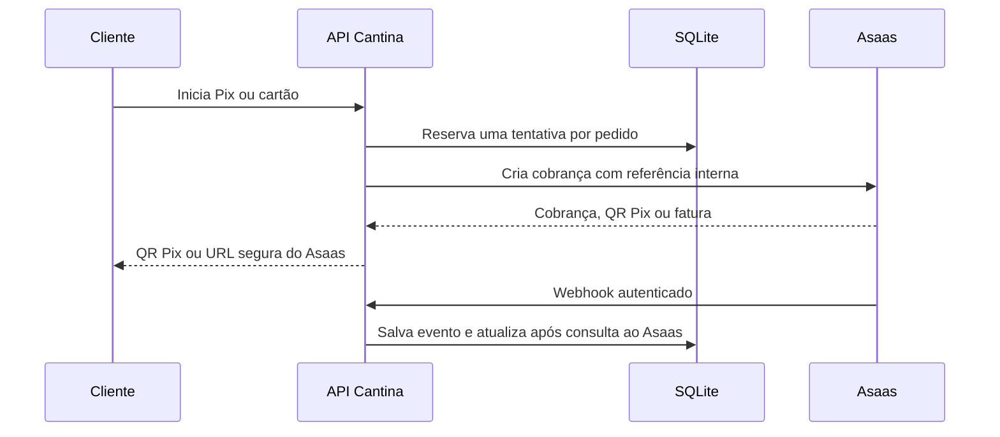

# Pagamentos Asaas — Cantina

Data: 07/09/2026. A Cantina usa exclusivamente o **Asaas** para criar, consultar, confirmar e cancelar cobranças online.

## Fluxo



- Pix: a API retorna `qrCode` e `qrCodeBase64`.
- Cartão: a API retorna a fatura hospedada do Asaas; os dados do cartão nunca passam pela Cantina.
- O pedido só é aprovado depois que a API consulta o Asaas e confirma valor, referência, cliente e meio de pagamento.
- Uma cobrança pendente por pedido é reutilizada. Em falha de rede, a tentativa fica em verificação e é conciliada antes de nova emissão.
- Webhooks entram em caixa persistente e são processados a cada 10 segundos. A conciliação também recupera eventos perdidos.

## Rotas

Todas usam o prefixo `/api/v1`.

| Método | Rota | Proteção | Resultado |
| --- | --- | --- | --- |
| `GET` | `/payments/public-config` | pública | meios habilitados e ambiente; sem segredos |
| `POST` | `/payments/orders/:orderId/pix` | JWT + CSRF | cria/reutiliza Pix Asaas |
| `POST` | `/payments/orders/:orderId/card` | JWT + CSRF | cria/reutiliza fatura de cartão Asaas |
| `GET` | `/payments/orders/:orderId/reconcile` | JWT | consulta e atualiza a cobrança |
| `POST` | `/payments/orders/:orderId/cancel` | JWT + CSRF | cancela cobrança pendente Asaas |
| `POST` | `/webhooks/asaas` | `asaas-access-token` | recebe evento e responde `200` após persistir |

O cliente só pode operar seus próprios pedidos. A API obtém valor e identidade a partir do banco; não aceita valor, CPF ou token de cartão enviados pelo navegador.

## Configuração

Guardar as variáveis em arquivo privado da stack. Nunca publicar chaves na Vercel, no frontend, em commits ou em logs.

```dotenv
ASAAS_ENV=sandbox                 # sandbox ou production
ASAAS_ACCOUNT_REF=identificador-estavel-da-conta
ASAAS_API_KEY_SANDBOX=            # $aact_hmlg_...
ASAAS_API_KEY_PRODUCTION=         # $aact_prod_...
ASAAS_WEBHOOK_TOKEN_SANDBOX=      # aleatório, 32+ caracteres
ASAAS_WEBHOOK_TOKEN_PRODUCTION=   # outro valor aleatório, 32+ caracteres
ASAAS_CALLBACK_SUCCESS_URL=       # opcional; HTTPS e cadastrado no Asaas
PAYMENTS_NEW_CHARGES_ENABLED=true
SALES_ENABLED=true
```

`ASAAS_ENV` escolhe uma base fixa: Sandbox usa `https://api-sandbox.asaas.com/v3`; produção usa `https://api.asaas.com/v3`. A chave deve ter o prefixo compatível com o ambiente. Se chave, referência de conta ou token de webhook não existirem, novas cobranças ficam desabilitadas.

`ASAAS_CALLBACK_SUCCESS_URL` é opcional. Quando preenchida, precisa ser HTTPS, sem credenciais e cadastrada na conta Asaas. O Sandbox pode operar sem ela; o checkout retorna manualmente à Cantina e a conciliação atualiza o pedido.

No painel Asaas, criar um webhook por ambiente para:

```text
https://SEU_DOMINIO/api/v1/webhooks/asaas
```

Configurar o mesmo token no header `asaas-access-token`. Assinar os eventos de cobrança disponíveis, ao menos criação, confirmação, recebimento, vencimento, exclusão, estorno e chargeback.

## Banco e histórico

A migration `20260907210000_asaas_payments` cria:

- `asaas_customers`, separado por usuário, ambiente e conta;
- `asaas_webhook_inbox`, deduplicado por evento, ambiente e conta;
- campos de escopo, estado de criação, reembolso e revisão em `payment_transactions`.

Registros financeiros já existentes são preservados. O campo antigo de identificador de cliente permanece apenas como `legacyPaymentCustomerRef` mapeado para a coluna existente; não é lido nem escrito pela integração atual. Não há criação de cobranças, SDK, endpoint, configuração ou webhook dos provedores anteriores.

Aplicar antes de iniciar a API:

```bash
npx prisma migrate deploy --schema apps/api/prisma/schema.prisma
```

Fazer backup do SQLite antes de aplicar em produção. O rollback seguro da aplicação é pausar novas cobranças com `PAYMENTS_NEW_CHARGES_ENABLED=false`; não remover as tabelas Asaas enquanto houver cobranças pendentes ou eventos a reconciliar.

## Operação

- Use Sandbox com banco e stack próprios. Nunca use chave Sandbox contra banco de produção.
- Antes de mudar `ASAAS_ENV`, deixe pendências do ambiente atual resolvidas.
- Para manutenção, use `PAYMENTS_NEW_CHARGES_ENABLED=false`: emissão para, mas webhook, consulta e conciliação continuam.
- Não faça fallback automático para outro gateway após timeout ou erro. A conciliação procura a cobrança pela referência da tentativa antes de qualquer nova emissão.
- Pagamentos recebidos depois de pedido cancelado ou expirado ficam em revisão operacional; o pedido não é reaberto automaticamente.

## Homologação

1. Configure credencial, referência de conta, token de webhook e URL pública temporária no ambiente isolado.
2. Crie pedido online com cliente ativo, CPF e celular válidos.
3. Gere Pix; valide QR/copia-e-cola e confirme a cobrança no Sandbox.
4. Gere cartão; valide a URL HTTPS do Sandbox e conclua com cartão de teste no Asaas.
5. Verifique webhook na caixa de entrada, transação aprovada e pedido pago.
6. Gere uma pendência e cancele-a; confirme que a mesma cobrança não é reutilizada como aprovada.
7. Teste reinício da API e conciliação de uma cobrança já existente.

## Publicação

1. Faça backup do banco e aplique a migration.
2. Configure as variáveis privadas na stack do backend e o webhook de produção.
3. Atualize o frontend e backend juntos, pois cartão agora redireciona para a fatura Asaas.
4. Faça uma venda real de baixo valor somente após validar Sandbox e webhook no domínio de produção.
5. Monitore a caixa de entrada, pendências de criação e transações em revisão nas primeiras vendas.
