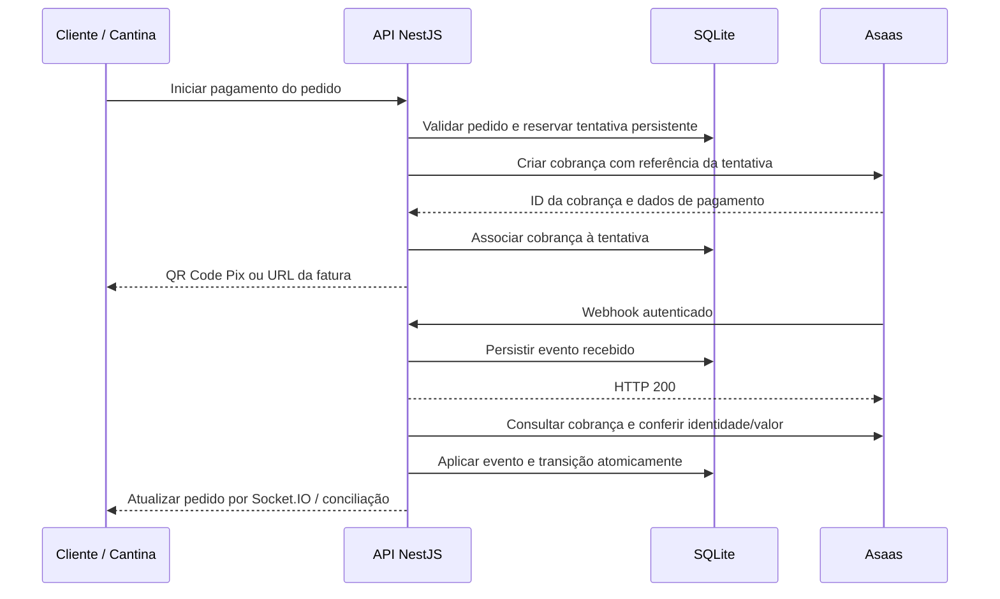

# Migração de Mercado Pago para Asaas — Cantina

Data: 07/09/2026. Código consultado: commit `138c3ec`.

**Status: especificação para implementação futura.** Este documento não altera o backend, a Vercel, o banco ou as contas de pagamento. As variáveis e contratos marcados como propostos ainda precisam ser implementados. “Asas”, no pedido original, foi interpretado como **Asaas**.

## 1. Objetivo e decisões de escopo

Substituir o Mercado Pago nas novas cobranças da Cantina, preservando pedidos, usuários, valores, histórico financeiro e acompanhamento de cobranças antigas.

Proposta inicial:

- Pix: manter QR Code e copia e cola dentro da Cantina.
- Cartão: começar com a fatura hospedada pelo Asaas, acessada por `invoiceUrl`. O cliente informa o cartão na página do provedor e retorna à Cantina para acompanhar o pedido.
- AbacatePay: preservar a integração existente. Retirá-la é uma decisão adicional, não uma consequência automática da troca do Mercado Pago.
- Parcelamento: manter compra à vista. O checkout atual envia `installments: 1`, embora o DTO aceite até 24.
- Cartões salvos: comunicar que precisarão ser cadastrados novamente; não reutilizar IDs ou tokens do Mercado Pago no Asaas.
- Balcão, dinheiro, crédito interno e fiado: preservar as regras atuais.

A alternativa com cartão dentro da própria Cantina está detalhada na seção 7. A modalidade hospedada é uma recomendação de implementação, não uma decisão já aprovada pelo responsável pelo produto.

### Decisões necessárias antes de programar

| Decisão | Proposta | Consequência |
| --- | --- | --- |
| Experiência de cartão | Fatura Asaas hospedada | Exige redirecionamento e retorno ao pedido; elimina dependência do formulário Mercado Pago para novas cobranças |
| Pix acima do limiar atual | Continuar no AbacatePay | Preserva o comportamento existente |
| Concentrar todo Pix no Asaas | Etapa opcional posterior | Exige revisar roteamento, custos e pendências AbacatePay |
| Cartões salvos na primeira entrega | Desabilitados para Asaas | Exibir aviso claro; implementação posterior depende da modalidade e habilitação |
| Confirmação de Pix | Liberar apenas após recebimento validado | Evita liberar pedido durante eventual bloqueio cautelar |
| Pagamento após expiração | Revisão operacional, sem reabrir pedido automaticamente | Evita vender estoque já devolvido |
| Notificações Asaas ao cliente | Desabilitadas inicialmente | Evita mensagens duplicadas com a Cantina; revisar decisão comercial |
| Estorno inicial | Operação pelo painel Asaas, com sincronização no sistema | Não exige criar uma tela administrativa nova nesta migração |

Valores mínimos aceitos, taxas, antecipação, prazos de recebimento e condições comerciais precisam ser confirmados na conta contratada. Não há cotação ou economia presumida neste guia. Incluir pedidos de baixo valor da cantina na homologação.

## 2. Situação atual verificada no código

O sistema já usa **dois provedores**. Cartão é Mercado Pago; Pix é escolhido em `pickPixProvider`:

1. Havendo credencial Mercado Pago e total menor ou igual a `PIX_THRESHOLD`, usa Mercado Pago.
2. Caso contrário, havendo AbacatePay, usa AbacatePay.
3. Sem AbacatePay, usa Mercado Pago se configurado.
4. Sem nenhum provedor, retorna erro.

O limiar padrão é **R$ 80,00**; isso descreve a regra do código, não comprova qual valor está configurado agora no servidor.

| Arquivo | Responsabilidade e impacto da migração |
| --- | --- |
| [`payments.service.ts`](../apps/api/src/payments/payments.service.ts) | Roteamento, clientes Mercado Pago, criação, cartões salvos, status, assinatura de webhook, conciliação e auditoria |
| [`payments.controller.ts`](../apps/api/src/payments/payments.controller.ts) | Endpoints de pagamentos e webhooks; adicionar receptor Asaas |
| [`payment.dto.ts`](../apps/api/src/payments/dto/payment.dto.ts) | DTO de cartão contém campos próprios do Mercado Pago |
| [`payments.module.ts`](../apps/api/src/payments/payments.module.ts) | Registrar cliente Asaas e processamento adicional |
| [`CheckoutPage.tsx`](../apps/web/src/pages/client/CheckoutPage.tsx) | SDK Mercado Pago, tokenização, seleção de cartões, Pix e polling |
| [`schema.prisma`](../apps/api/prisma/schema.prisma) | SQLite, `User.mercadoPagoCustomerId`, transações e eventos de webhook |
| [`payment-reconciliation.task.ts`](../apps/api/src/scheduler/payment-reconciliation.task.ts) | Executa conciliação a cada minuto |
| [`expiration.task.ts`](../apps/api/src/scheduler/expiration.task.ts) | Expiração de tickets/pedidos a cada cinco minutos |
| [`app-settings.service.ts`](../apps/api/src/common/services/app-settings.service.ts) | Janela do ticket, configuração de balcão e arquivo `cantina-settings.json` |
| [`payments.service.spec.ts`](../apps/api/src/payments/payments.service.spec.ts) | Testes existentes de concorrência, repetição, assinaturas e regressões de status |
| [Segurança existente](../PAYMENT_SECURITY_IMPROVEMENTS.md) | Histórico de requisitos que devem continuar atendidos |
| [Deploy](../deploy/README.md) e [Compose](../docker-compose.prod.yml) | Backend no servidor local, SQLite persistente, túnel e variáveis privadas |

Contratos atuais, todos sob `/api/v1`:

| Método e rota | Uso |
| --- | --- |
| `GET /payments/public-config` | Habilitação de meios e chave pública Mercado Pago |
| `POST /payments/orders/:orderId/pix` | Criar/reutilizar tentativa Pix |
| `POST /payments/orders/:orderId/card` | Criar/reutilizar tentativa de cartão |
| `GET /payments/orders/:orderId/reconcile` | Consultar andamento do pedido |
| `GET /payments/saved-cards` | Listar cartões Mercado Pago |
| `POST /webhooks/mercadopago` | Atualizar cobranças Mercado Pago |
| `POST /webhooks/abacatepay` | Atualizar cobranças AbacatePay |

As rotas de criação já usam JWT, guarda CSRF e limite de chamadas. A identidade do pagador vem do usuário autenticado; o total vem do pedido no banco. Manter essas garantias.

### Pontos que impedem uma troca apenas de chaves

- `GatewayProvider` aceita apenas `MERCADO_PAGO` e `ABACATE_PAY`.
- `getPublicConfig` depende das chaves Mercado Pago para habilitar cartão.
- A API usa tokens diferentes por `NODE_ENV`. Asaas deve ter ambiente explícito, separado do modo de execução do Node.
- A trava por pedido dura 30 segundos. A criação remota ocorre antes da persistência da transação local.
- `attemptKey` tem índice, mas não restrição de unicidade.
- Eventos são registrados antes de aplicar o resultado, em operações separadas: uma falha intermediária pode fazer uma repetição ser descartada sem concluir o pagamento.
- `PaymentWebhookEvent` exige pedido e transação associados; não serve, sozinho, como caixa de entrada para eventos ainda não correlacionados.
- A conciliação atual consulta pendentes com ID externo, exclui certos pedidos encerrados e não cobre a evolução posterior de pagamentos aprovados.
- `markOrderPaid` não possui uma política específica para recebimento tardio em pedido expirado/cancelado. A alteração de estado também precisa proteger pedidos em preparo e outros estados posteriores.
- O modelo atual não distingue estorno parcial, processamento de estorno e resultado de criação desconhecido.

Essas são observações do código. Corrigi-las na implementação Asaas é parte da prevenção de cobrança duplicada e inconsistência financeira.

## 3. Fluxo proposto



O processador da caixa de entrada pode usar o scheduler e SQLite existentes. Não é necessário introduzir Redis ou uma fila externa apenas para esta migração. Antes de responder `200`, o evento precisa estar duravelmente salvo; recebê-lo apenas em memória não basta.

## 4. Conta, ambientes e configuração

### Preparação operacional

1. Criar conta Sandbox e conta de produção separadas.
2. Concluir cadastro e habilitações exigidas pela conta de produção; verificar disponibilidade de Pix e cartão.
3. Criar chaves próprias da aplicação e definir responsável por guarda e rotação.
4. Confirmar configuração Pix da conta e homologar o QR Code de cobrança.
5. Definir contato operacional para alertas de webhook, regras de notificações, juros, multas e descontos. Para pedidos da cantina, a proposta é não alterar o valor após a criação.
6. Se houver cartão transparente/tokenização, solicitar habilitação de produção antes de prometer cartões salvos.

O Asaas usa `access_token`, `User-Agent` e JSON. Bases: `https://api-sandbox.asaas.com/v3` e `https://api.asaas.com/v3`. A chave deve pertencer ao mesmo ambiente da URL. A integração é feita pelo backend. [Autenticação oficial](https://docs.asaas.com/docs/autentica%C3%A7%C3%A3o-1).

### Variáveis propostas — ainda sem efeito no código atual

```dotenv
# A aplicação pode rodar em produção e usar o Sandbox em uma stack de homologação.
NODE_ENV=production
ASAAS_ENV=sandbox
ASAAS_API_KEY_SANDBOX='PREENCHER_FORA_DO_GIT'
ASAAS_API_KEY_PRODUCTION='PREENCHER_FORA_DO_GIT'
ASAAS_WEBHOOK_TOKEN_SANDBOX='GERAR_SEGREDO_ALEATORIO_SEPARADO'
ASAAS_WEBHOOK_TOKEN_PRODUCTION='GERAR_OUTRO_SEGREDO_ALEATORIO'
ASAAS_USER_AGENT='Cantina/1.0'

# Seleção para NOVAS tentativas; histórico continua usando seu provedor original.
PAYMENT_CARD_PROVIDER=MERCADO_PAGO
PAYMENT_PIX_PRIMARY_PROVIDER=MERCADO_PAGO
PAYMENT_PIX_SECONDARY_PROVIDER=ABACATE_PAY
PIX_THRESHOLD=80
ASAAS_CARD_FLOW=HOSTED_INVOICE
PAYMENTS_NEW_CHARGES_ENABLED=true

APP_PUBLIC_URL=https://cantina.neurelix.com.br
PAYMENTS_WEBHOOK_BASE_URL=https://api-cantina.neurelix.com.br
CORS_ORIGIN=https://cantina.neurelix.com.br
PAYMENT_RECONCILIATION_BATCH_SIZE=20
```

Regras propostas para configuração:

- `ASAAS_ENV` aceita somente `sandbox` ou `production`; derivar a URL de uma lista fixa, sem aceitar hosts arbitrários.
- Selecionar exclusivamente chave e token correspondentes ao ambiente. Ausência de credencial do provedor selecionado deve bloquear novas cobranças desse meio, com alerta operacional.
- `PAYMENTS_NEW_CHARGES_ENABLED=false` bloqueia criação, mas mantém consultas, recebimento de webhooks e conciliação. Não deve interromper a resolução de cobranças já existentes.
- No corte, alterar cartão e Pix primário para `ASAAS`. Manter secundário `ABACATE_PAY` preserva a regra por valor; `NONE` significa usar apenas o primário para todos os valores.
- A presença de uma chave antiga não deve reativar automaticamente seu provedor para novas vendas.
- Não fazer fallback para outro gateway após timeout ou resultado incerto; primeiro resolver a tentativa anterior.
- `APP_PUBLIC_URL` continua sendo a URL do frontend. A nova base de webhooks evita confundir o retorno do cliente com o receptor financeiro.
- Segredos ficam em `.env.production` privada no servidor; não usar prefixo `VITE_`, não publicar por `public-config` e não incluí-los na imagem Docker.
- Aspas simples no arquivo de ambiente preservam caracteres especiais de chaves. Nunca copiar credenciais reais para exemplos ou documentação.

Homologação deve ter banco, credenciais, domínio e stack próprios. **Não apontar o Sandbox para o banco de produção nem trocar as chaves da stack ativa para executar testes.** Registrar o domínio de homologação quando provisionado; ele ainda não está definido neste guia.

## 5. Persistência, clientes e compatibilidade

### Clientes Asaas

Criar cliente sob demanda em `POST /customers`, com nome, CPF/CNPJ, e-mail, celular e `externalReference` baseado no ID interno. Armazenar o ID retornado. `notificationDisabled: true` implementa a proposta de não duplicar notificações. O Asaas permite clientes duplicados, portanto uma nova tentativa de cadastro exige consulta e controle local. [Cadastro de cliente](https://docs.asaas.com/reference/criar-novo-cliente).

Proposta de tabela `PaymentCustomer`:

| Campo | Uso |
| --- | --- |
| `id`, `userId` | Identidade local e vínculo com usuário |
| `provider`, `environment`, `accountRef` | Namespace do cliente externo; `accountRef` é identificador estável da conta, sem segredo |
| `externalCustomerId` | ID `cus_...` do Asaas |
| `createdAt`, `updatedAt` | Rastreabilidade |

Criar unicidade por usuário/provedor/ambiente/conta e por cliente externo no mesmo namespace. Proteger cadastro concorrente; se houver timeout, procurar cadastro pela referência e conferir CPF antes de repetir. Não relacionar clientes apenas por e-mail.

Preservar `User.mercadoPagoCustomerId`. Não copiar esse valor para a nova tabela como se fosse Asaas. Rotação de chave da mesma conta não deve criar um namespace de conta novo.

### Transações e eventos

Aplicar migrations **aditivas**, mantendo todos os registros antigos:

| Alteração proposta | Motivo |
| --- | --- |
| Adicionar `ASAAS` ao tipo de provedor | Novo roteamento e adaptador |
| Adicionar ambiente e referência de conta às transações | Evitar colisões e consultas no ambiente errado |
| Migrar unicidade global de `externalId` para namespace completo | IDs de provedores/contas diferentes não devem disputar a mesma chave |
| Tornar referência da tentativa única no namespace | Detectar reutilização e concorrência |
| Adicionar `creationState` | Distinguir `CREATING`, `CREATED`, `UNKNOWN`, `FAILED`, sem tratar erro de transporte como recusa financeira |
| Adicionar `gatewayStatus`, `refundedAmountCents` e dados de estorno pendente | Representar evolução financeira sem reduzir tudo a aprovado/recusado |
| Criar `PaymentWebhookInbox` | Persistir evento antes de haver correlação e permitir reprocessamento |

A caixa de entrada precisa de provedor, ambiente, conta, `eventKey`, payload sanitizado, datas, estado de processamento, tentativas, próxima execução e erro resumido. Pedido/transação devem ser opcionais na recepção. Unicidade: provedor/ambiente/conta/evento.

O backfill dos registros antigos exige identificar sua origem real. `NODE_ENV=production` no deploy atual não prova que todas as transações históricas foram criadas em produção. Registros de origem indeterminada devem ficar sinalizados, sem consulta automática com credencial presumida.

Não misturar situação financeira com situação do pedido. Um pedido retirado pode sofrer chargeback posteriormente; ele não volta à fila da cozinha. Não transformar estorno parcial em estorno integral.

## 6. Pix dentro da Cantina

Fluxo proposto:

1. Validar usuário, titularidade do pedido, total, situação, CPF e telefone.
2. Obter/criar cliente Asaas e reservar a tentativa no banco antes da chamada externa.
3. Criar cobrança `PIX`, usando valor do pedido em centavos convertido para reais e referência imutável da tentativa.
4. Persistir `payment.id` imediatamente, mesmo que a consulta do QR Code falhe depois.
5. Consultar `GET /payments/{id}/pixQrCode` e devolver seus dados ao frontend.
6. Confirmar por webhook/consulta autenticada, conferindo valor bruto e identidade.

Exemplo ilustrativo de corpo para `POST /payments`; IDs e data devem ser calculados pelo backend:

```json
{
  "customer": "cus_EXEMPLO",
  "billingType": "PIX",
  "value": 18.5,
  "dueDate": "2026-09-07",
  "description": "Pedido da Cantina",
  "externalReference": "cantina:production:order-123:attempt-456"
}
```

Criar cobrança não confirma recebimento. Conferir também configurações globais de cobrança para que juros, multa ou desconto não alterem inadvertidamente o total. [Criar cobrança](https://docs.asaas.com/reference/criar-nova-cobranca).

Mapear retorno do QR Code: `payload` para `qrCode`, `encodedImage` para `qrCodeBase64`, `expirationDate` para validade do QR. O frontend já possui normalização de imagem Base64. O QR tem regras próprias de validade; `dueDate` não é um cronômetro de minutos. [QR Code Pix](https://docs.asaas.com/reference/obter-qr-code-para-pagamentos-via-pix).

Definir separadamente validade do pedido, da tentativa e do QR remoto. Guardar a validade remota nos detalhes; a interface não pode prometer que um QR deixou de ser pagável só porque terminou seu contador. Na expiração local, tentar encerrar a cobrança remota e acompanhar eventual corrida com pagamento. Falha ao obter QR de uma cobrança já criada deve retomar essa cobrança, sem criar outra.

O Asaas admite Pix `CONFIRMED` temporário em situações de bloqueio cautelar de contas de pessoa física. A proposta conservadora é liberar Pix com `RECEIVED`, mantendo demais estados em acompanhamento. [Observação sobre Pix na criação de cobranças](https://docs.asaas.com/reference/criar-nova-cobranca).

## 7. Cartão: modalidade inicial e alternativa

### Modalidade proposta: fatura hospedada

Criar `POST /payments` com `billingType: CREDIT_CARD`, cliente, valor, vencimento e referência, sem enviar dados de cartão. Guardar `payment.id` e retornar `invoiceUrl` como `checkoutUrl` no contrato interno. [Cobranças por cartão](https://docs.asaas.com/docs/cobrancas-via-cartao-de-credito).

A tela deve oferecer “Pagar com cartão no Asaas”, informar o redirecionamento e permitir reabrir a mesma tentativa pendente. O retorno à Cantina consulta o pedido; visitar uma URL de sucesso não aprova nada. Configurar retorno quando suportado pela fatura utilizada e homologar a navegação real no celular/PWA.

Não confundir a fatura de uma cobrança (`/payments`, `invoiceUrl`) com o produto **Asaas Checkout** (`/checkouts`). O segundo retorna uma sessão/link e possui callbacks próprios; escolhê-lo exige persistir ID da sessão separado do ID da cobrança e adaptar correlação/conciliação. É alternativa válida, mas não o contrato principal deste guia. [Asaas Checkout](https://docs.asaas.com/docs/asaas-checkout).

### Alternativa: cartão transparente

Se for requisito manter o formulário dentro da Cantina, revisar essa parte antes da implementação:

- Substituir SDK/campos Mercado Pago e contrato de tokenização, sem supor equivalência de SDK ou chave pública Asaas.
- A API Asaas aceita dados do cartão/titular ou `creditCardToken`; o token pertence ao cliente correspondente. Produção depende de habilitação da tokenização. [Tokenização](https://docs.asaas.com/reference/tokenizacao-de-cartao-de-credito).
- Revisar coleta de dados do titular/endereço e proteção do fluxo. Não armazenar PAN ou CVV em SQLite, logs, auditoria, fila ou backup. Não devolver tokens de cartão ao navegador em respostas comuns.
- Obter `remoteIp` de uma cadeia de proxies confiável, considerando Cloudflare e bloqueio de acesso direto; não confiar em um header arbitrário enviado pelo cliente.
- A chamada que processa cartão exige timeout mínimo de 60 segundos segundo a referência. A trava atual de 30 segundos precisa ser substituída por controle persistente com renovação/estado de tentativa. Um timeout continua sendo resultado desconhecido. [Criar cobrança com cartão](https://docs.asaas.com/reference/criar-cobranca-com-cartao-de-credito).
- Para cartões salvos, criar armazenamento protegido de tokens Asaas por cliente/ambiente/conta e devolver somente identificador local e dados mascarados. Revalidar a titularidade a cada uso.

Não prometer migração automática dos cartões Mercado Pago. O caminho previsto é novo cadastramento autorizado pelo cliente no novo provedor. A proposta hospedada não implementa uma carteira de cartões Asaas dentro da Cantina.

## 8. Contratos da API e frontend

Preservar URLs de criação e conciliação. O backend decide provedor e valor; não aceitar essas decisões do navegador.

Exemplo de `public-config` proposto após o corte, com AbacatePay preservado:

```json
{
  "allowOnPickupPayment": true,
  "onlineEnabled": true,
  "pixEnabled": true,
  "cardEnabled": true,
  "pixPrimaryProvider": "ASAAS",
  "pixSecondaryProvider": "ABACATE_PAY",
  "cardProvider": "ASAAS",
  "cardFlow": "HOSTED_INVOICE",
  "savedCardsEnabled": false,
  "mercadoPagoPublicKey": null
}
```

`allowOnPickupPayment` continua derivado das configurações reais, não fixo no valor do exemplo. Manter campos antigos durante a transição. A chave pública Mercado Pago pode continuar disponível enquanto a versão compatível da interface ainda precisa atender cobranças legadas.

Acrescentar à resposta de pagamento `checkoutUrl`, `creationState` e os campos financeiros necessários, preservando os atuais `id`, `provider`, `paymentMethod`, `status`, `qrCode`, `qrCodeBase64`, `expiresAt`, `paidAt` e `lastError`. Não reutilizar `ticketUrl` com significado diferente sem revisar todos os consumidores.

Mudanças em `CheckoutPage.tsx`:

1. Renderizar o fluxo por capacidade/configuração e pelo provedor da tentativa existente.
2. No cartão hospedado, enviar DTO vazio apropriado e redirecionar para URL validada do Asaas; não exigir `cardToken` Mercado Pago.
3. Manter formulário Mercado Pago enquanto houver compatibilidade necessária; impedir envio de seus tokens ao adaptador Asaas.
4. Exibir QR Pix, retomada de pagamento, recusa, expiração e processamento desconhecido.
5. Ocultar cartões salvos quando indisponíveis e explicar novo cadastro.
6. Continuar atualização por Socket.IO e conciliação, reduzindo polling quando a aba estiver oculta.
7. Testar retorno do aplicativo bancário/navegador para a PWA e atualização de service worker.

Não remover `@mercadopago/sdk-js` antes do encerramento da coexistência. `GET /payments/saved-cards` deve respeitar o provedor da experiência ativa e continuar compatível com clientes antigos durante o período acordado.

## 9. Webhook Asaas

Novo receptor proposto em produção:

```text
POST https://api-cantina.neurelix.com.br/api/v1/webhooks/asaas
```

Sandbox deve usar o receptor da stack de homologação. Ele não deve compartilhar chave, banco ou token de webhook com produção.

Criar configuração no painel ou via `POST /webhooks`, com URL, e-mail operacional, `enabled: true`, `interrupted: false`, `apiVersion: 3`, `sendType: SEQUENTIALLY` e segredo próprio. Usar `authToken` aleatório, entre 32 e 255 caracteres, diferente da API Key. Guardar também o ID da configuração. [Provisionamento de webhook](https://docs.asaas.com/docs/criar-novo-webhook-pela-api).

Eventos iniciais:

```text
PAYMENT_CREATED
PAYMENT_UPDATED
PAYMENT_CONFIRMED
PAYMENT_RECEIVED
PAYMENT_OVERDUE
PAYMENT_DELETED
PAYMENT_RESTORED
PAYMENT_AWAITING_RISK_ANALYSIS
PAYMENT_APPROVED_BY_RISK_ANALYSIS
PAYMENT_REPROVED_BY_RISK_ANALYSIS
PAYMENT_AUTHORIZED
PAYMENT_CREDIT_CARD_CAPTURE_REFUSED
PAYMENT_REFUND_IN_PROGRESS
PAYMENT_REFUNDED
PAYMENT_PARTIALLY_REFUNDED
PAYMENT_CHARGEBACK_REQUESTED
PAYMENT_CHARGEBACK_DISPUTE
PAYMENT_AWAITING_CHARGEBACK_REVERSAL
```

O envelope usa `id` para identificar o evento, `event` para seu tipo e `payment` para a cobrança. A mesma cobrança pode gerar muitos eventos; não usar `payment.id` como chave de deduplicação do evento. [Eventos de cobrança](https://docs.asaas.com/docs/webhook-para-cobrancas).

### Recepção e processamento

1. Validar o header `asaas-access-token` com o segredo do ambiente, comparando de modo seguro. Não esperar HMAC Mercado Pago nem usar segredo na URL. [Autenticação de webhooks](https://docs.asaas.com/docs/sobre-os-webhooks).
2. Aceitar campos novos no payload e validar campos essenciais, com limite de tamanho. A validação global `forbidNonWhitelisted` não deve rejeitar campos extras legítimos do Asaas.
3. Persistir evento sanitizado em `PaymentWebhookInbox`, inclusive quando a associação à transação ainda não existir.
4. Responder **HTTP 200 explicitamente** após persistência. Em NestJS usar `@HttpCode(200)`: o padrão de `@Post` é inadequado para esse contrato. Duplicatas já persistidas também retornam 200.
5. Processar em segundo plano, consultando `GET /payments/{id}` com credencial do ambiente/conta esperado.
6. Conferir referência local, cliente, provedor, conta, ambiente, forma de pagamento e valor bruto em centavos. `netValue` desconta taxas e não substitui o total do pedido.
7. Em transação de banco, aplicar a transição financeira, a alteração condicional do pedido e o estado processado do evento. Uma falha deve permitir reprocessar.
8. Publicar atualização da interface após commit. A consulta do pedido precisa recuperar uma notificação Socket.IO eventualmente perdida.

O receptor não exige JWT/CSRF do usuário, pois é chamado pelo Asaas; sua autenticação é própria. Verificar que Cloudflare não impõe login ou desafio interativo nessa rota, sem desabilitar proteções de outras rotas.

Se o banco falhar antes da persistência, retornar erro para permitir retentativa. Um evento autenticado de outra cobrança da mesma conta pode ser armazenado e classificado como não relacionado; não deve bloquear a fila indefinidamente. Divergências relevantes ficam em quarentena com alerta e evidência sanitizada.

O Asaas considera sucesso de entrega **HTTP 200**; outras respostas podem falhar. A fila pode ser interrompida após 15 falhas consecutivas, com retenção de eventos de 14 dias. Monitorar e reativar após corrigir a causa. [Fila pausada](https://docs.asaas.com/docs/fila-pausada).

## 10. Estados, expiração, estorno e conciliação

### Política de normalização proposta

Consultar a cobrança é a base para interpretar o evento. Os estados financeiros internos precisam acomodar os casos abaixo; não aplicar diretamente a máquina atual sem ajustes.

| Situação verificada | Tratamento interno proposto |
| --- | --- |
| `PENDING`, análise de risco ou autorização sem captura | Pendente; não liberar pedido |
| Cartão `CONFIRMED` | Aprovar pagamento após conferências; registrar liquidação separadamente |
| `RECEIVED` por meio esperado | Aprovar uma única vez |
| Pix `CONFIRMED` | Aguardar recebimento conforme política da seção 6 |
| `OVERDUE` ou remoção | Atualizar cobrança; não presumir impossibilidade de recebimento tardio |
| Recusa de análise/captura | Registrar falha da tentativa; consultar estado antes de permitir nova cobrança |
| Estorno em andamento | Registrar pendência; não afirmar devolução concluída |
| Estorno parcial | Atualizar centavos devolvidos; manter saldo e histórico |
| Estorno integral concluído | Registrar `REFUNDED` e auditar |
| Chargeback/disputa/reversão | Registrar evolução financeira e revisão operacional |
| Recebimento manual em dinheiro | Não confirmar automaticamente como Pix/cartão online |
| Estado desconhecido | Reter evento, sinalizar e consultar; nunca aprovar por padrão |

As distinções entre confirmação, recebimento, estorno e disputa vêm do contrato do provedor; a política de liberação acima é uma proposta da Cantina. [Consulta da cobrança](https://docs.asaas.com/reference/recuperar-uma-unica-cobranca) e [eventos financeiros](https://docs.asaas.com/docs/webhook-para-cobrancas).

### Pagamento tardio e cancelamento

Nunca fazer `EXPIRED → PAID` ou `CANCELLED → PAID` automaticamente: o estoque pode já ter sido devolvido. Registrar o recebimento financeiro, alertar o operador e aplicar decisão de atendimento ou estorno. Não regredir pedido em preparo, pronto ou retirado quando chegar uma confirmação repetida.

Excluir uma cobrança não devolve pagamento recebido. Para encerrar cobrança não paga usar `DELETE /payments/{id}`; para devolver valores usar `POST /payments/{id}/refund`, conferindo resultado e eventos. Estornos parciais exigem controlar o total já devolvido. [Excluir cobrança](https://docs.asaas.com/reference/excluir-cobranca) e [estornar cobrança](https://docs.asaas.com/reference/estornar-cobranca).

Na primeira entrega, estornos podem ser iniciados pelo operador no painel, com motivo registrado e conciliação posterior. O saldo disponível pode limitar o estorno e taxas podem não ser devolvidas; o operador deve conferir essas condições antes de prometer devolução concluída. [Regras de estorno](https://docs.asaas.com/reference/estornar-cobranca).

### Conciliação e retentativas

- Manter webhooks como fluxo principal; usar consulta de cobrança por ID para recuperação.
- Resolver `UNKNOWN`/tentativas sem ID externo por `externalReference`, com paginação e conferência completa. [Listagem de cobranças](https://docs.asaas.com/reference/listar-cobrancas).
- Incluir recebimentos possíveis em pedidos expirados/cancelados; não repetir o filtro restritivo atual.
- Reconciliar também situações financeiras abertas após aprovação, como liquidação pendente, estorno e disputa.
- Manter adaptadores Mercado Pago/AbacatePay para suas transações históricas, independentemente do roteamento de novas vendas.
- Distribuir tentativas por próxima execução; não deixar um lote de registros antigos bloquear os novos. Limitar concorrência e usar espera progressiva com variação aleatória.
- Em `429`, respeitar informações de limite retornadas; não criar uma tempestade de retentativas. [Limites da API](https://docs.asaas.com/reference/api-limits).

Definir janela operacional e responsável por revisão de pendências antigas. Uma cobrança aprovada não deve desaparecer do acompanhamento necessário apenas porque o pedido foi retirado.

## 11. Idempotência e cobrança duplicada

`externalReference` serve para correlação e consulta. Não presumir que ele impõe unicidade remota. Este guia não assume suporte do Asaas ao `X-Idempotency-Key` usado no Mercado Pago.

Algoritmo local proposto:

1. Reservar tentativa persistente com referência única antes de qualquer criação remota.
2. Garantir exclusão por pedido entre Pix e cartão, incluindo processos simultâneos e reinícios.
3. Reutilizar tentativa existente pagável ou de resultado desconhecido. Consultar todas as tentativas relevantes, sem depender apenas das dez mais recentes.
4. Associar a resposta remota à mesma tentativa. Não gerar nova referência porque houve timeout.
5. Em timeout, desconexão ou `5xx` inconclusivo, marcar `UNKNOWN`; bloquear nova cobrança até consulta, webhook ou revisão resolver a situação.
6. Uma busca momentaneamente vazia não prova que a criação remota falhou. Repetir consultas com atraso e encaminhar a revisão se a ambiguidade persistir.
7. Liberar nova tentativa apenas após conclusão comprovada da anterior, incluindo encerramento de eventual cobrança ainda pagável.

Uma transação de SQLite não deve permanecer aberta durante a chamada de rede. Usar reserva/lease curta em transação e estado persistente durante o processamento externo.

Proteções necessárias: confirmação concorrente de webhook e scheduler, duplicata após reinício, evento recebido antes da resposta da criação e falha entre salvar evento e atualizar pedido. Duplicidade financeira não se resolve apenas evitando o segundo `ORDER_PAID`: identificar as duas cobranças e encaminhar devolução da cobrança indevida.

## 12. Sequência de implementação

| Etapa | Entrega verificável |
| --- | --- |
| 1. Fechar decisões | Modalidade de cartão, Pix secundário, validade, notificações e responsáveis definidos |
| 2. Migração de dados | Schema aditivo, namespaces, tentativas persistentes e caixa de entrada; restauração ensaiada |
| 3. Cliente Asaas | Serviço pequeno no módulo de pagamentos para autenticação, chamadas, erros sanitizados e normalização |
| 4. Fluxos de pagamento | Clientes, Pix, fatura de cartão e retomada sem duplicação |
| 5. Webhooks/conciliação | Recepção durável, processamento idempotente, estados tardios e suporte ao histórico |
| 6. Frontend compatível | Novas capacidades, redirecionamento, retomada, aviso de cartões e fluxo legado |
| 7. Homologação | Matriz abaixo concluída com evidências e pendências explícitas |
| 8. Corte controlado | Alterar somente seleção de novas cobranças; observar pedidos reais autorizados |
| 9. Encerramento legado | Remover código/chaves somente após critérios da seção 14 |

Preservar a organização NestJS existente. Um cliente `asaas.client.ts` e um normalizador de status, dentro do módulo de pagamentos, são suficientes para começar. Não é necessário criar uma plataforma genérica de gateways ou alterar o banco para PostgreSQL.

## 13. Plano de homologação e aceite

Executar em stack isolada, com dados fictícios e contatos próprios/autorizados. Sandbox oferece testes de cobrança e webhook; alguns cenários, como chargeback, podem exigir apoio do Asaas. Validar também diferenças de habilitação entre Sandbox e produção. [Recursos de Sandbox](https://docs.asaas.com/docs/o-que-pode-ser-testado) e [FAQ Sandbox](https://docs.asaas.com/docs/faq-sandbox).

| Cenário | Resultado obrigatório |
| --- | --- |
| CPF/telefone ausente ou pedido de outro usuário | Bloqueio antes da chamada ao provedor |
| Cliente já cadastrado e cadastro concorrente | Reutilização sem associação incorreta |
| Pix nos dois lados de R$ 80 e sem secundário | Provedor corresponde à configuração proposta |
| Valores baixos, centavos e total adulterado pelo navegador | Valor aceito validado; cobrança usa exclusivamente total do banco |
| QR criado, consulta da imagem falha | Retoma mesma cobrança |
| Dois cliques, duas abas, Pix e cartão concorrentes | Uma única tentativa pagável por pedido |
| Timeout antes/depois de criação remota | Estado desconhecido e recuperação; nenhuma nova cobrança automática |
| Cartão aprovado/recusado/análise de risco | Estado correto, sem aprovação antecipada |
| Retorno direto à URL de sucesso | Pedido permanece dependente de confirmação autenticada |
| Webhook com token ausente/incorreto | Sem alteração financeira |
| Evento repetido e campos extras | HTTP 200 para duplicata válida; efeito financeiro único |
| Evento chega antes da resposta da criação | Evento preservado e correlacionado depois |
| Falha após salvar evento | Processador retoma e conclui; evento não é perdido por deduplicação |
| Valor, cliente, referência ou ambiente divergente | Quarentena e alerta; pedido não aprovado |
| Webhook e conciliação aprovam simultaneamente | Uma transição do pedido, sem duplicar efeitos |
| Confirmação atrasada após pedido expirado/cancelado | Recebimento registrado, pedido não reaberto automaticamente |
| Estorno parcial/integral e chargeback | Saldos e auditoria consistentes; pedido não volta à cozinha |
| Webhook indisponível e recuperação da fila | Retentativa/caixa de entrada/conciliação convergem |
| API reinicia durante pagamento | Tentativa e evento persistem |
| `429`, `5xx`, chave errada/ausente | Mensagem segura, espera progressiva e alerta |
| PWA antiga/atual, celular e retorno do banco | Contratos compatíveis e pedido recuperável |
| Cobrança Mercado Pago anterior ao corte | Continua recebendo webhook e sendo conciliada pelo adaptador original |
| Backup/restauração de schema e imagem compatíveis | Integridade e registros comprovados |

Reaproveitar os testes de `payments.service.spec.ts`, adicionando cobertura dos pontos acima. Testes de banco devem incluir SQLite real nas garantias de unicidade/transação, pois mocks não demonstram persistência após falha. Verificar frontend e chamadas públicas no domínio de homologação.

Este trabalho de documentação não executou testes, builds, cobranças ou estornos.

## 14. Publicação, coexistência e rollback

### Preparação do corte

1. Registrar imagem/commit em uso e inventário de cobranças por provedor, ambiente e estado.
2. Fazer backup consistente recente do SQLite, uploads, configurações e segredos privados; ensaiar restauração isolada. O backup de 07/09/2026 já existente é histórico e não substitui um backup no momento da migração.
3. Incluir `cantina-settings.json` no inventário e garantir persistência. O Compose atual monta banco e uploads, mas não esse arquivo de configuração explicitamente.
4. Publicar backend compatível com os provedores antigo e novo, mantendo novas cobranças no roteamento anterior.
5. Publicar frontend compatível na Vercel e confirmar atualização da PWA antes de ativar Asaas para cartão.
6. Preparar receptor e webhook de produção com token correto. Confirmar HTTP 200 e observabilidade antes do primeiro pagamento.
7. Ativar Asaas por configuração para novas tentativas; manter as existentes no provedor de origem.
8. Acompanhar pagamentos reais controlados, previamente autorizados pelo responsável, incluindo retorno ao app e recebimento no provedor.

Infraestrutura documentada:

```text
Servidor: /home/kali/progetos/cantina-stack
Compose: docker-compose.prod.yml
Ambiente privado: .env.production
Banco: data/cantina.db
Frontend: https://cantina.neurelix.com.br
API: https://api-cantina.neurelix.com.br
Webhook proposto: /api/v1/webhooks/asaas
```

O Compose já injeta `.env.production` na API; não precisa de novo container de banco para Asaas. Mudanças nesse arquivo exigem recriar o container para carregar variáveis. Build, migrations e publicação só entram na execução futura, depois da homologação.

### Rollback de roteamento

Se novas cobranças Asaas falharem:

1. Bloquear novas tentativas do meio afetado, preservando recepção e conciliação.
2. Identificar cobranças Asaas pendentes/ambíguas antes de liberar novas tentativas dos mesmos pedidos.
3. Voltar o provedor de **novas** cobranças para Mercado Pago, usando a versão compatível e credenciais válidas.
4. Continuar acompanhando cobranças Asaas já criadas até resolução; não desligar seu webhook.
5. Manter frontend capaz de mostrar/retomar as duas modalidades durante a recuperação.

**Não restaurar automaticamente um backup antigo após vendas novas.** Isso apagaria pedidos e vínculos de cobranças que continuam existindo no provedor. Rollback preferencial é de configuração/código compatível, mantendo dados. Restauração completa é procedimento de desastre, com conciliação de todas as operações posteriores ao backup.

### Encerramento do Mercado Pago

Somente retirar SDK, adaptador, endpoint e credenciais após concluir: cobranças pendentes, ambiguidades, estornos, disputas e necessidades de consulta histórica. A janela de acompanhamento deve respeitar condições dos provedores e obrigações operacionais aplicáveis; não fixar um prazo arbitrário de poucos dias.

Não reemitir no Asaas cobranças já pagas no Mercado Pago. Não mover saldo ou recebíveis por alteração de registros locais. AbacatePay segue ativo até decisão específica de desativação, com o mesmo cuidado sobre suas pendências.

## 15. Operação e critérios de conclusão

Monitorar: tempo até confirmação, idade da pendência mais antiga, tentativas desconhecidas, falhas de criação, duplicidades, divergências de valor, atraso da caixa de entrada, fila Asaas interrompida, estornos pendentes e erros de autenticação.

Logs devem identificar pedido, tentativa, evento e provedor, sem chave de API, token de webhook, token de cartão, PAN, CVV ou payload completo com dados pessoais. Sanitizar também erros retornados pelo provedor e payloads persistidos em auditoria/backups.

Checklist de conclusão da implementação:

- [ ] Escopo e modalidade de cartão aprovados pelo responsável.
- [ ] Conta Asaas e meios necessários habilitados.
- [ ] Sandbox isolado e matriz de testes concluída.
- [ ] Migrations aditivas e origem do histórico verificadas.
- [ ] Tentativas persistentes e recuperação de criação ambígua funcionando.
- [ ] Webhook autenticado, durável, idempotente e com HTTP 200 explícito.
- [ ] Status, expiração, estornos e disputas tratados.
- [ ] Frontend/Vercel/PWA compatíveis publicados antes do corte.
- [ ] Cobranças legadas continuam consultáveis e conciliáveis.
- [ ] Backup recente restaurável e rollback de roteamento ensaiado.
- [ ] Teste real controlado autorizado e conferido no Asaas.
- [ ] Responsável por alertas e pendências definido.

Os links oficiais ao longo do documento sustentam os contratos externos consultados em 07/09/2026. Variáveis, tabelas, políticas de transição e sequência de implementação são propostas específicas para este repositório; revisar a referência Asaas novamente ao implementar.
